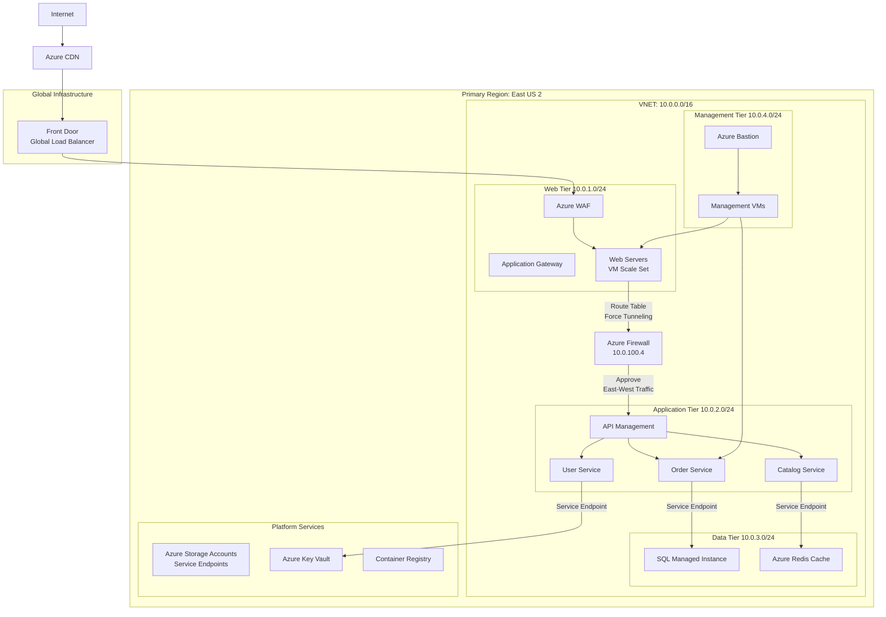

# Case Study: Global E-Commerce Platform Migration to Azure

## **Company Profile: "ShopGlobal"**
- **Industry**: E-commerce retail
- **Scale**: 50 million users, $2B annual revenue
- **Challenge**: Migrate from on-premises data center to Azure while improving security, scalability, and performance

## **Architecture Implementation**



---

## **Traffic Flow: Customer Purchase Journey**

### **Step 1: Product Browsing**
```bash
User Request Flow:
Customer → Azure CDN → Front Door → WAF (Web Subnet) → 
Azure Firewall → API Management (App Subnet) → 
Catalog Service → Redis Cache (Data Subnet)

# Security Controls:
- Web NSG: Allow 443 from Front Door IPs only
- Route Table: Force all web→app traffic through firewall
- App NSG: Allow 8080 only from Web Subnet via Firewall
- DB NSG: Allow 6379 only from App Subnet
```

### **Step 2: User Login & Session Management**
```bash
Authentication Flow:
Customer → Web Tier → Azure Firewall → 
User Service → Azure AD → 
Key Vault (Service Endpoint) → 
SQL MI (User Database)

# Security Controls:
- Service Endpoint for Key Vault: Private Azure backbone
- SQL MI: Only accessible from Data Subnet
- NSG Rules: Block all direct internet outbound from App/DB tiers
```

### **Step 3: Order Processing**
```bash
Order Pipeline:
Web Tier → Azure Firewall → 
Order Service → Service Bus → 
SQL MI (Orders) → 
Storage Account (Receipts)

# Architecture Benefits:
- Async processing via Service Bus
- Data segregation: PII in SQL, files in Storage
- Service Endpoints for all PaaS services
```

---

## **NSG Configuration Examples**

### **Web Subnet NSG (10.0.1.0/24)**
```json
{
  "Inbound Rules": [
    "Allow TCP 443 from AzureFrontDoor.Backend",
    "Allow TCP 22 from MgmtSubnet (10.0.4.0/24)",
    "Deny all other inbound"
  ],
  "Outbound Rules": [
    "Allow TCP 8080 to AppSubnet (10.0.2.0/24)",
    "Allow TCP 443 to AzureMonitor",
    "Deny all other outbound"
  ]
}
```

### **App Subnet NSG (10.0.2.0/24)**
```json
{
  "Inbound Rules": [
    "Allow TCP 8080 from WebSubnet (10.0.1.0/24)",
    "Allow TCP 22 from MgmtSubnet (10.0.4.0/24)",
    "Deny all other inbound"
  ],
  "Outbound Rules": [
    "Allow TCP 1433 to SQL MI (10.0.3.0/24)",
    "Allow TCP 6379 to Redis (10.0.3.5)",
    "Allow TCP 443 to Service Endpoints",
    "Deny all other outbound"
  ]
}
```

### **DB Subnet NSG (10.0.3.0/24)**
```json
{
  "Inbound Rules": [
    "Allow TCP 1433 from AppSubnet (10.0.2.0/24)",
    "Allow TCP 6379 from AppSubnet (10.0.2.0/24)",
    "Deny all other inbound"
  ],
  "Outbound Rules": [
    "Deny all outbound to internet",
    "Allow TCP 443 to Service Endpoints"
  ]
}
```

---

## **Route Table Configuration**

### **Web Subnet Route Table**
```bash
# Custom Routes:
Address Prefix: 10.0.2.0/24    Next Hop: Azure Firewall (10.0.100.4)
Address Prefix: 0.0.0.0/0       Next Hop: Internet
Address Prefix: 10.0.0.0/16     Next Hop: VNET Local

# Purpose: Force all east-west traffic through firewall for inspection
```

### **App Subnet Route Table**
```bash
# Custom Routes:
Address Prefix: 10.0.3.0/24    Next Hop: Azure Firewall (10.0.100.4)
Address Prefix: 0.0.0.0/0       Next Hop: None (No Internet)
Address Prefix: 10.0.0.0/16     Next Hop: VNET Local

# Purpose: Ensure all data tier traffic is inspected, block internet egress
```

---

## **Service Endpoints Implementation**

### **PaaS Service Security**
```bash
# Azure SQL Managed Instance:
- Firewall: Deny public access
- VNET Rules: Allow only DB Subnet (10.0.3.0/24)
- Service Endpoint: Microsoft.Sql enabled on DB Subnet

# Azure Storage:
- Firewall: Deny public access
- VNET Rules: Allow Web/App/DB subnets
- Service Endpoints: Microsoft.Storage enabled on all subnets

# Azure Key Vault:
- Firewall: Deny public access
- VNET Access: Allow only App Subnet
- Service Endpoint: Microsoft.KeyVault enabled on App Subnet
```

---

## **Business Outcomes & Metrics**

### **Performance Improvements**
- **Page Load Time**: Reduced from 3.2s to 1.1s (Azure CDN + optimized routing)
- **Database Throughput**: Increased by 40% (dedicated subnets, no noisy neighbors)
- **Availability**: 99.99% uptime achieved (multi-tier redundancy)

### **Security & Compliance**
- **Security Incidents**: Reduced by 75% (microsegmentation)
- **PCI DSS Compliance**: Achieved (network isolation, logging)
- **Data Exfiltration Prevention**: Blocked via NSG outbound rules

### **Operational Efficiency**
- **Deployment Time**: Reduced from 4 hours to 15 minutes (Infrastructure as Code)
- **Incident Resolution**: 60% faster (clear tier boundaries)
- **Cost Optimization**: 35% savings (right-sized subnets, PaaS services)

### **Scalability Achieved**
```bash
Black Friday Traffic Handling:
- Web Tier: Scaled from 10 to 100 instances (VM Scale Sets)
- App Tier: Scaled from 20 to 150 containers (AKS)
- Database: Handled 50K transactions/minute
- Zero security rule changes during scaling
```

---

## **Architecture Validation Against Requirements**

| **Requirement** | **Architecture Solution** | **Result** |
|-----------------|--------------------------|------------|
| **Security** | Layered NSGs, Azure Firewall, Service Endpoints | Zero data breaches post-migration |
| **Scalability** | Tier-specific scaling, Load balancers | Handled 10x traffic spikes |
| **Performance** | Optimized routing, CDN, Caching | <2s page loads globally |
| **Compliance** | Network isolation, Logging | PCI DSS, GDPR compliant |
| **Cost Control** | Subnet sizing, PaaS services | 35% cost reduction |

