# Comprehensive Case Study: Global Financial Trading Platform "FinTrade Pro"

## **Company Profile & Business Context**

### **Background**
**FinTrade Pro** - A multinational financial services company providing real-time trading platforms
- **Industry**: Financial Technology & Trading
- **Scale**: 2 million active traders, $50B daily transaction volume
- **Regulations**: SEC, FINRA, MiFID II, GDPR, SOX
- **Previous Infrastructure**: On-premises data centers across 3 regions

### **Business Drivers for Azure Migration**
1. **Latency Reduction**: Sub-millisecond trade execution requirements
2. **Global Expansion**: Need to enter APAC markets with low latency
3. **Disaster Recovery**: Regulatory requirement for 99.995% availability
4. **Security Compliance**: Multi-regulatory compliance across 15 countries
5. **Cost Optimization**: Reduce $15M annual infrastructure costs

---

## **Detailed Architecture Implementation**

```mermaid
flowchart TD
    Internet
    CorpNetwork[Corporate Offices]
    PartnerExt[Exchange Partners]
    
    subgraph GlobalInfra [Global Infrastructure]
        AFD[Azure Front Door<br/>WAF Premium]
        TrafficManager[Traffic Manager<br/>Performance Routing]
    end

    subgraph PrimaryRegion [Primary Region: East US 2]
        subgraph FinTradeVNET [VNET: 10.20.0.0/16]
            direction TB
            
            subgraph DMZTier [DMZ Tier 10.20.1.0/26]
                WAF[Azure WAF<br/>Custom Rules]
                AppGW[Application Gateway v2<br/>WAF Enabled]
                ReverseProxy[HAProxy<br/>SSL Termination]
            end

            subgraph WebTier [Web Tier 10.20.2.0/24]
                WebVMSS[VM Scale Set<br/>8x D4s v3]
                APIGW[Azure API Gateway<br/>Internal]
                AuthService[OAuth2 Service]
            end

            subgraph AppTier [Application Tier 10.20.3.0/23]
                subgraph TradingServices [Trading Microservices]
                    OrderService[Order Management]
                    ExecutionService[Trade Execution]
                    PricingService[Real-time Pricing]
                    RiskService[Risk Management]
                end
                
                subgraph DataServices [Data Microservices]
                    MarketDataService[Market Data Feed]
                    AnalyticsService[Analytics Engine]
                    ReportingService[Reporting Service]
                end
                
                AKSCluster[AKS Cluster<br/>50+ Microservices]
                ServiceMesh[Istio Service Mesh]
            end

            subgraph DataTier [Data Tier 10.20.5.0/24]
                subgraph SQLCluster [SQL Server AlwaysOn]
                    SQLPrimary[SQL Primary<br/>E32s v3]
                    SQLSecondary[SQL Secondary<br/>Sync Replication]
                end
                
                RedisCluster[Redis Enterprise<br/>Cluster Mode]
                CosmosDB[Cosmos DB<br/>Multi-Master]
                BlobStorage[Azure Premium Storage]
            end

            subgraph MgmtTier [Management Tier 10.20.8.0/27]
                Bastion[Azure Bastion<br/>JIT Access]
                JumpBoxes[Management VMs<br/>4x B2ms]
                Monitoring[Grafana, Prometheus]
            end

            subgraph SecurityTier [Security Tier 10.20.100.0/26]
                AZFW[Azure Firewall Premium<br/>TLS Inspection]
                IDS[Azure IDPS<br/>Intrusion Detection]
                LogAnalytics[Log Analytics Workspace]
            end
        end
        
        subgraph PaaSServices [Managed Services]
            KeyVault[Azure Key Vault<br/>HSM Backed]
            ServiceBus[Azure Service Bus<br/>Premium Tier]
            EventHub[Event Hubs<br/>Real-time Streams]
            ACR[Container Registry<br/>Geo-replicated]
        end
    end

    subgraph DRRegion [DR Region: West Europe]
        DRVNET[DR VNET<br/>10.21.0.0/16]
        AsyncReplication[Async Replication<br/>30s RPO]
    end

    %% Traffic Flows
    Internet --> AFD
    CorpNetwork --> ExpressRoute[ExpressRoute<br/>Private Peering]
    PartnerExt --> VPNGateway[Site-to-Site VPN]
    
    AFD --> AppGW
    ExpressRoute --> AppGW
    VPNGateway --> AppGW
    
    AppGW --> WebVMSS
    WebVMSS -- "Route Table<br/>Force Tunneling" --> AZFW
    AZFW -- "Traffic Inspection<br/>& Filtering" --> APIGW
    
    APIGW --> TradingServices
    APIGW --> DataServices
    
    OrderService -- "Service Endpoint<br/>Private Link" --> SQLPrimary
    MarketDataService -- "Service Endpoint" --> CosmosDB
    RiskService -- "Service Endpoint" --> RedisCluster
    
    TradingServices --> ServiceBus
    ServiceBus --> AnalyticsService
    
    Bastion --> JumpBoxes
    JumpBoxes -.->|Management| WebVMSS
    JumpBoxes -.->|Management| AKSCluster
    JumpBoxes -.->|Management| SQLCluster
```



---

## **Network Security Groups (NSG) Detailed Configuration**

### **DMZ Subnet NSG (10.20.1.0/26)**
```json
{
  "name": "nsg-dmz-001",
  "priority": 100,
  "direction": "Inbound",
  "access": "Allow",
  "protocol": "TCP",
  "sourcePortRange": "*",
  "destinationPortRange": "443",
  "sourceAddressPrefix": "AzureFrontDoor.Backend",
  "destinationAddressPrefix": "10.20.1.4"
},
{
  "priority": 110,
  "direction": "Inbound",
  "access": "Allow", 
  "protocol": "TCP",
  "sourcePortRange": "*",
  "destinationPortRange": "443",
  "sourceAddressPrefix": "Corp-ExpressRoute-Range",
  "destinationAddressPrefix": "10.20.1.4"
},
{
  "priority": 200,
  "direction": "Inbound", 
  "access": "Deny",
  "protocol": "*",
  "sourcePortRange": "*",
  "destinationPortRange": "*",
  "sourceAddressPrefix": "Internet",
  "destinationAddressPrefix": "10.20.1.0/26"
}
```

### **Application Tier NSG (10.20.3.0/23)**
```json
{
  "name": "nsg-app-001",
  "priority": 100,
  "direction": "Inbound",
  "access": "Allow",
  "protocol": "TCP",
  "sourcePortRange": "*",
  "destinationPortRange": "8080-8090",
  "sourceAddressPrefix": "10.20.2.0/24",
  "destinationAddressPrefix": "10.20.3.0/23"
},
{
  "priority": 110,
  "direction": "Inbound",
  "access": "Allow",
  "protocol": "TCP",
  "sourcePortRange": "*",
  "destinationPortRange": "9090-9100",
  "sourceAddressPrefix": "10.20.100.4",
  "destinationAddressPrefix": "10.20.3.0/23"
},
{
  "priority": 500,
  "direction": "Outbound",
  "access": "Deny",
  "protocol": "*",
  "sourcePortRange": "*",
  "destinationPortRange": "*",
  "sourceAddressPrefix": "10.20.3.0/23",
  "destinationAddressPrefix": "Internet"
}
```

---

## **Route Tables & User-Defined Routes (UDR)**

### **Web Tier Route Table**
```bash
# Custom Routes for Force Tunneling
Address Prefix: 10.20.3.0/23    Next Hop: Virtual Appliance (10.20.100.4)
Address Prefix: 10.20.5.0/24     Next Hop: Virtual Appliance (10.20.100.4) 
Address Prefix: 10.0.0.0/8       Next Hop: Virtual Appliance (10.20.100.4)
Address Prefix: 172.16.0.0/12    Next Hop: Virtual Appliance (10.20.100.4)
Address Prefix: 192.168.0.0/16   Next Hop: Virtual Appliance (10.20.100.4)
Address Prefix: 0.0.0.0/0        Next Hop: Internet

# BGP Routes from ExpressRoute
Address Prefix: 10.10.0.0/16     Next Hop: ExpressRoute Gateway
```

### **Application Tier Route Table**
```bash
# Strict Internal Routing
Address Prefix: 10.20.5.0/24     Next Hop: Virtual Appliance (10.20.100.4)
Address Prefix: 10.20.8.0/27     Next Hop: Virtual Appliance (10.20.100.4)
Address Prefix: 0.0.0.0/0        Next Hop: None (Blackhole)

# Service Endpoint Routes (System)
Address Prefix: 23.100.0.0/16    Next Hop: Internet (Microsoft.Sql)
Address Prefix: 13.85.0.0/16     Next Hop: Internet (Microsoft.Storage)
```

---

## **Service Endpoints & Private Links Implementation**

### **Azure SQL Managed Instance**
```bash
# Network Configuration
Subnet: 10.20.6.0/28 (Dedicated SQL MI Subnet)
NSG: Allow 1433 only from App Tier (10.20.3.0/23)
Route Table: No internet egress
Service Endpoint: Microsoft.Sql enabled

# Security
Azure AD Authentication: Required
Transparent Data Encryption: Enabled
Advanced Threat Protection: Enabled
Auditing: All operations logged
```

### **Azure Key Vault (HSM Backed)**
```bash
# Network Security
Firewall: Enabled, Deny public access
Virtual Network Access: Allow only App Tier (10.20.3.0/23)
Service Endpoint: Microsoft.KeyVault enabled
Private Link: kv-fintrade.private.azure.com

# Access Policies
Application: Read secrets, keys, certificates
Managed Identity: AKS cluster identity
RBAC: Fine-grained access control
```

### **Azure Storage Accounts**
```bash
# Configuration
Storage Type: Premium FileShares
Network: Selected networks only
Service Endpoints: Microsoft.Storage on App/Data tiers
Private Endpoints: blob, file, table, queue

# Security
Require secure transfer: Yes
Allow blob public access: No
Minimum TLS version: 1.2
```

---

## **Real-Time Trading Flow with Security Controls**

### **Trade Execution Sequence**
```bash
# Step 1: Client Connection
Trader WebSocket → Azure Front Door (WAF) → 
Application Gateway (SSL Offload) → 
Web Tier (Authentication) → 
Azure Firewall (Traffic Inspection)

# Security Controls:
- WAF Rules: SQL injection, XSS protection
- Rate Limiting: 1000 requests/second per IP
- Geo-filtering: Block restricted countries
- TLS 1.3 enforced

# Step 2: Order Validation
Web Tier → Azure Firewall → 
API Gateway (Internal) → 
Order Service → Risk Service → 
SQL MI (Portfolio Check)

# Security Controls:
- NSG: Allow 8080 only from Web Tier via Firewall
- Service Endpoint: SQL MI private connection
- Azure AD: Service-to-service authentication
- Encryption: Always encrypted for PII data

# Step 3: Market Data Processing
Market Data Feed → Event Hubs → 
Pricing Service → Redis Cluster → 
Web Tier (Real-time updates)

# Security Controls:
- Private Link: Event Hubs private endpoint
- Network Security: Redis cluster in data subnet
- Data Encryption: At rest and in transit
- Access Control: SAS tokens with short expiry

# Step 4: Trade Execution
Order Service → Exchange Gateway → 
Execution Service → SQL MI (Trade Store) → 
Service Bus (Notification) → 
Web Tier (Confirmation)

# Security Controls:
- Firewall Rules: Allow outbound to exchange IPs only
- Audit Trail: All trades logged immutable
- Compliance: MiFID II trade reporting
- Data Integrity: Cryptographic signing
```

---

## **Disaster Recovery & High Availability**

### **Multi-Region Deployment**
```bash
Primary Region: East US 2 (10.20.0.0/16)
DR Region: West Europe (10.21.0.0/16)
Backup Region: Southeast Asia (10.22.0.0/16)

# Replication Configuration:
- SQL MI: Async replication (30s RPO)
- Cosmos DB: Multi-master, 15ms write latency
- Storage: Geo-redundant storage (GRS)
- AKS: Cluster replication with GitOps
```

### **Failover Automation**
```bash
# Traffic Manager Configuration
Endpoint Monitoring: HTTP/HTTPS health probes
Failover Threshold: 3 consecutive failures
TTL: 30 seconds (low for financial apps)

# Automation Runbooks:
- DNS failover (Front Door)
- Database promotion (SQL MI)
- Service re-routing (Service Bus)
- Secret rotation (Key Vault)
```

---

## **Monitoring & Compliance Implementation**

### **Azure Monitor Configuration**
```bash
# Key Metrics Monitored:
- Trade Execution Latency: <100ms threshold
- Database Throughput: DTU consumption
- Network Latency: Inter-tier communication
- Security Events: Failed authentications

# Alert Rules:
- P1: Trading system unavailable
- P2: Performance degradation
- P3: Security anomalies
- P4: Capacity planning
```

### **Compliance & Auditing**
```bash
# Regulatory Requirements:
- SEC 17a-4: Trade data retention (7 years)
- FINRA 4511: Books and records
- MiFID II: Transaction reporting
- GDPR: Right to be forgotten

# Implementation:
- Immutable storage for audit logs
- Automated compliance reporting
- Regular penetration testing
- Third-party security audits
```

---

## **Business Outcomes & ROI**

### **Performance Metrics**
```bash
# Pre-Migration vs Post-Migration
Trade Execution Latency: 45ms → 8ms (82% improvement)
System Availability: 99.9% → 99.99% (4x improvement)
Deployment Frequency: Monthly → Daily (30x improvement)
Security Incidents: 12/month → 2/month (83% reduction)
```

### **Financial Impact**
```bash
# Cost Analysis
Infrastructure Costs: $1.8M/month → $1.1M/month (39% savings)
Operational Efficiency: 40 FTE → 28 FTE (30% reduction)
Compliance Costs: $500k/year → $200k/year (60% savings)
Business Growth: Enabled 3 new market entries
```

