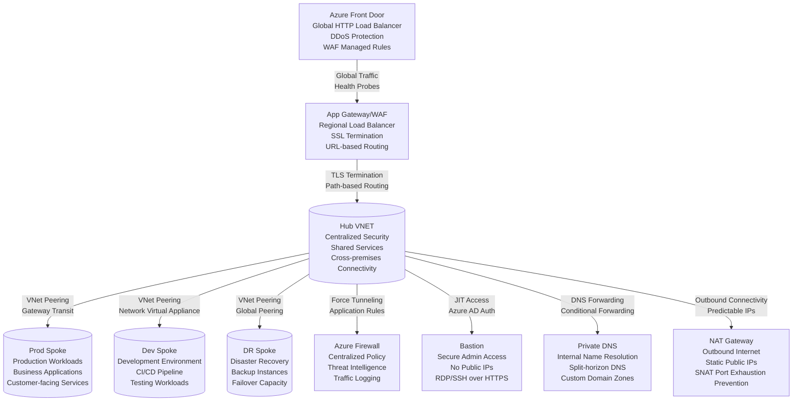
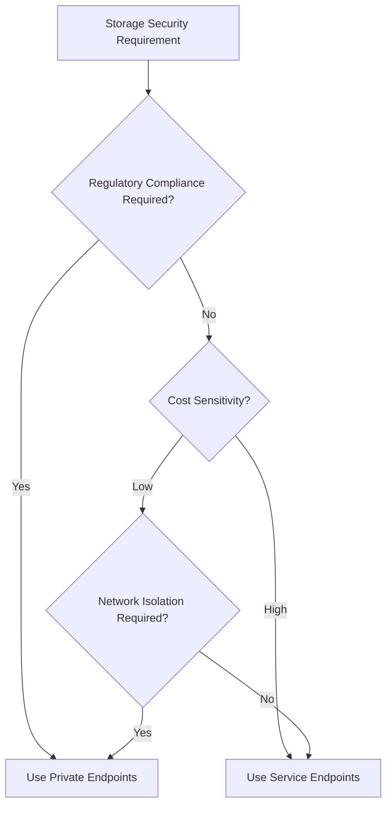
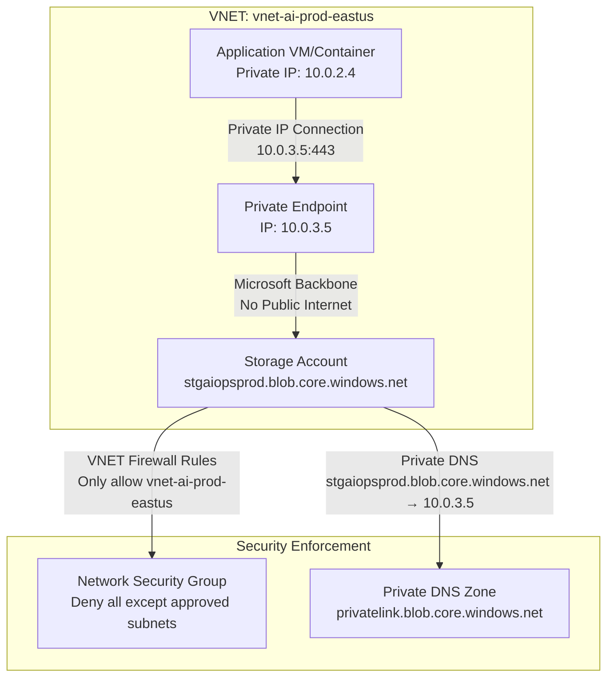
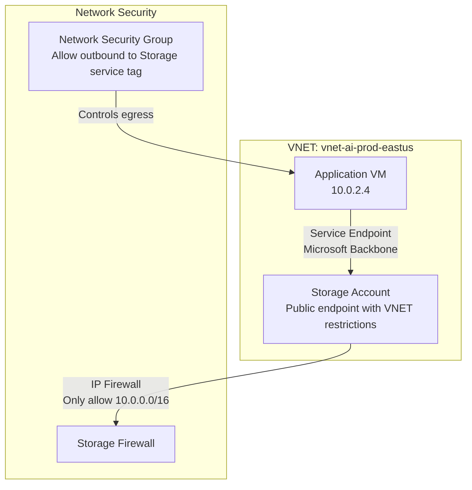
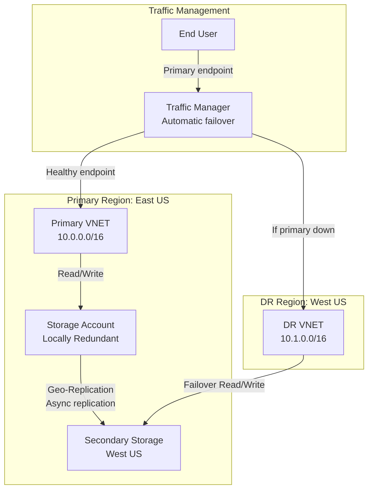

# 🧭 Azure Virtual Network (VNET) Enterprise Implementation Playbook

**Version 4.0 | Audience:** Architects · Cloud Ops · AI/ML Infra · Security · FinOps
**Scope:** Multi-Org  |  Hybrid  |  Multi-Cloud  |  AI-Integrated  |  Zero-Trust Design

---

## 🏗️ Phase 1 – Architecture & Planning

### 🎯 Objectives

**Primary Goals:**
* **Design secure, scalable VNETs** for multi-organization and multi-region operations with proper isolation boundaries between different business units and environments
* **Plan Hub-Spoke connectivity** to establish centralized security controls and shared services while maintaining workload isolation in spoke virtual networks
* **Implement IP addressing strategy** that supports growth, avoids conflicts with on-premises networks, and follows CIDR best practices for subnet allocation
* **Establish security segmentation** using network security groups, application security groups, and Azure Firewall to enforce least privilege access
* **Incorporate Zero-Trust principles** from Day 1 by verifying every request, using explicit authentication, and assuming breach scenarios
* **Design for Disaster Recovery** with cross-region replication, automated failover mechanisms, and recovery time objective (RTO) compliance

### 🧱 Reference Layers - Detailed Explanation

**Public Entry Tier:**
* **Purpose:** Serves as the internet-facing entry point for all inbound traffic with DDoS protection and web application firewall capabilities
* **Components:** Azure Front Door (global load balancer), Application Gateway (regional application delivery controller), Azure DDoS Protection Standard
* **Security:** Implements TLS termination, path-based routing, bot protection, and geographic filtering
* **CIDR:** Public IP addresses managed by Azure - no customer-managed IP ranges required

**Web Tier:**
* **Purpose:** Hosts user interface components, static content, and web servers that process HTTP/HTTPS requests from users
* **Components:** Azure Kubernetes Service (AKS) pods, App Service plans, Virtual Machine Scale Sets running web servers
* **Security:** Restricted inbound access only from Public Entry tier, outbound access to App tier only
* **CIDR:** 10.0.1.0/24 providing 251 usable IP addresses for web servers and load balancers

**App Tier:**
* **Purpose:** Contains business logic, API services, and microservices that process requests from web tier and communicate with data tier
* **Components:** Azure Functions, API Management, Container Instances, VM-based application servers
* **Security:** No direct internet access, inbound only from Web tier, outbound to Data tier and external APIs
* **CIDR:** 10.0.2.0/24 with segmentation for different application components and microservices

**Data Tier:**
* **Purpose:** Provides persistent data storage, databases, caching layers, and data processing services
* **Components:** Azure SQL Database, Cosmos DB, Storage Accounts, Redis Cache, Data Factory
* **Security:** Most restrictive controls, private endpoints only, no direct connectivity from web tier
* **CIDR:** 10.0.3.0/24 with potential further segmentation for different database types

**Management Tier:**
* **Purpose:** Enables operational management, monitoring, backup, and administrative access to all resources
* **Components:** Azure Bastion, Log Analytics agents, Backup vaults, Update Management, Automation Accounts
* **Security:** Just-in-time access, multi-factor authentication, privileged identity management
* **CIDR:** 10.0.4.0/24 with strict IP restrictions for administrative access

### 🗺️ Mermaid Architecture - Detailed Explanation



**Key Architecture Decisions:**
* **Hub-Spoke Topology:** Centralizes security controls, reduces management overhead, and enables shared services across multiple workloads
* **Azure Firewall:** Provides stateful firewall as a service with built-in high availability, unlimited cloud scalability, and threat intelligence-based filtering
* **Private DNS Zones:** Enables automatic registration of virtual machine records and provides name resolution across peered virtual networks
* **Bastion Host:** Eliminates the need for public IP addresses on virtual machines for management access, reducing attack surface
* **NAT Gateway:** Provides outbound internet connectivity without exposing inbound ports, using static predictable IP addresses

### 📐 Naming & Governance Plan - Detailed Explanation

**VNET Naming Convention:**
* **Pattern:** `vnet-[application]-[environment]-[region]`
* **Example:** `vnet-ai-prod-eastus`
* **Rationale:** Clearly identifies the purpose (AI workloads), environment (production), and region (East US) for easy resource identification and automation
* **Benefits:** Enables automated resource discovery, cost allocation, and policy application based on naming patterns

**Subnet Naming Convention:**
* **Pattern:** `snet-[tier]-[environment]`
* **Example:** `snet-data-prod`
* **Rationale:** Identifies the network tier and environment for proper security policy application and routing configuration
* **Benefits:** Simplifies network security group assignment and enables tier-specific monitoring

**Network Security Group Naming:**
* **Pattern:** `nsg-[tier]-[environment]`
* **Example:** `nsg-app-prod`
* **Rationale:** Associates security policies with specific network tiers and environments
* **Benefits:** Enables consistent security policy enforcement and audit trail generation

**Storage Account Naming:**
* **Pattern:** `stg[application][environment]`
* **Example:** `stgaiopsprod`
* **Rationale:** Globally unique name with application and environment identification
* **Benefits:** Complies with Azure Storage naming requirements while maintaining organizational context

**Policy Tag Strategy:**
* **Required Tags:** `env` (environment), `owner` (team/responsible party), `costcenter` (financial accountability)
* **Optional Tags:** `project`, `version`, `compliance`, `dataClassification`
* **Enforcement:** Azure Policy ensures all resources are tagged appropriately for cost management and compliance

---

## ⚙️ Phase 2 – Infrastructure Deployment

### 🧩 Resource Groups + VNET + Subnets - Detailed Explanation

**Resource Group Creation:**
```bash
# Create resource group with specific region for resource locality
az group create -n rg-ai-prod -l eastus --tags env=prod owner=ai-team costcenter=12345
```
* **Purpose:** Logical container for related resources that share the same lifecycle, permissions, and policies
* **Considerations:** Group resources by application, environment, or team ownership for optimal management
* **Best Practice:** Use consistent naming and tagging across all resource groups

**Virtual Network Creation:**
```bash
# Create virtual network with large address space for future expansion
az network vnet create -g rg-ai-prod -n vnet-ai-prod-eastus \
  --address-prefix 10.0.0.0/16 \
  --subnet-name snet-gateway --subnet-prefix 10.0.255.0/27 \
  --tags env=prod application=ai region=eastus
```
* **Address Space:** 10.0.0.0/16 provides 65,536 IP addresses across multiple subnets
* **Subnet Strategy:** Start with gateway subnet for VPN/ExpressRoute connectivity
* **DNS Settings:** Can configure custom DNS servers for hybrid name resolution

**Subnet Creation with Automation:**
```bash
# Automated subnet creation for standard tiers with calculated IP ranges
for snet in web app data mgmt; do
  az network vnet subnet create -g rg-ai-prod --vnet-name vnet-ai-prod-eastus \
    -n snet-$snet-prod --address-prefix 10.0.$((RANDOM%240)).0/24 \
    --network-security-group nsg-$snet-prod \
    --route-table rt-$snet-prod
done
```
* **Dynamic IP Allocation:** Uses calculated ranges to avoid conflicts
* **Associated Resources:** Automatically attaches NSGs and route tables
* **Delegation:** Can delegate subnets to specific Azure services like AKS or App Service

### 🧱 NSGs & Rules - Detailed Explanation

**Network Security Group Creation:**
```bash
# Create tier-specific NSG with descriptive naming
az network nsg create -g rg-ai-prod -n nsg-web-prod \
  --location eastus \
  --tags tier=web env=prod
```
* **Purpose:** Stateful firewall that controls inbound and outbound traffic at network layer
* **Scope:** Applied at subnet or network interface level for granular control
* **Stateful Nature:** Return traffic is automatically allowed for established connections

**Security Rule Configuration:**
```bash
# Allow HTTPS from internet to web tier
az network nsg rule create -g rg-ai-prod --nsg-name nsg-web-prod -n AllowHTTPS \
  --priority 100 \
  --protocol Tcp \
  --direction Inbound \
  --source-address-prefix Internet \
  --source-port-range "*" \
  --destination-address-prefix "*" \
  --destination-port-range 443 \
  --access Allow \
  --description "Allow HTTPS traffic from internet to web servers"

# Deny all other inbound internet traffic
az network nsg rule create -g rg-ai-prod --nsg-name nsg-web-prod -n DenyInternet \
  --priority 4096 \
  --protocol "*" \
  --direction Inbound \
  --source-address-prefix Internet \
  --source-port-range "*" \
  --destination-address-prefix "*" \
  --destination-port-range "*" \
  --access Deny \
  --description "Explicitly deny all other internet traffic"
```
* **Priority System:** Rules processed in priority order (100-4096), lower numbers evaluated first
* **Explicit Deny:** Final rule should explicitly deny all traffic not explicitly allowed
* **Service Tags:** Use Azure service tags (VirtualNetwork, AzureLoadBalancer, Internet) for simplified management

### 🛣️ Route Tables & Custom Routing - Detailed Explanation

**Route Table Creation:**
```bash
# Create custom route table for specific traffic routing requirements
az network route-table create -g rg-ai-prod -n rt-ai-prod \
  --disable-bgp-route-propagation true \
  --tags purpose=forced-tunneling env=prod
```
* **BGP Propagation:** Disabled to prevent on-premises routes from affecting cloud routing
* **Purpose:** Override system routes for specific traffic patterns or security requirements

**Custom Route Configuration:**
```bash
# Force all internet-bound traffic through Azure Firewall for inspection
az network route-table route create -g rg-ai-prod --route-table-name rt-ai-prod \
  -n ForceInternetViaFirewall \
  --next-hop-type VirtualAppliance \
  --address-prefix 0.0.0.0/0 \
  --next-hop-ip-address 10.0.0.4 \
  --description "Force all internet traffic through central firewall for inspection and logging"

# Specific route for on-premises connectivity
az network route-table route create -g rg-ai-prod --route-table-name rt-ai-prod \
  -n ToOnPrem \
  --next-hop-type VirtualNetworkGateway \
  --address-prefix 192.168.0.0/16 \
  --next-hop-ip-address 10.0.255.4 \
  --description "Route on-premises traffic through VPN gateway"
```
* **Forced Tunneling:** Redirects all internet-bound traffic to on-premises network or security appliance
* **Virtual Appliance Routing:** Directs traffic to network virtual appliances for advanced inspection
* **Address Prefix Specificity:** More specific routes (smaller CIDR) take precedence over less specific routes

**Subnet Association:**
```bash
# Apply route table to specific subnet
az network vnet subnet update -g rg-ai-prod -n snet-web-prod \
  --vnet-name vnet-ai-prod-eastus \
  --route-table rt-ai-prod \
  --description "Applied forced tunneling route table to web subnet"
```
* **Subnet-level Application:** Each subnet can have exactly one route table
* **Inheritance:** All resources in the subnet inherit the route table rules
* **Evaluation Order:** User-defined routes override system routes

### 🌐 NAT Gateway for Outbound Connectivity - Detailed Explanation

**NAT Gateway Creation:**
```bash
# Create NAT Gateway for predictable outbound connectivity
az network nat gateway create -g rg-ai-prod -n nat-ai-prod \
  --idle-timeout 10 \
  --zone 1 2 3 \
  --tags purpose=outbound env=prod
```
* **Idle Timeout:** Configurable 4-120 minutes, determines how long connection state is maintained
* **Availability Zones:** Zone-redundant configuration for high availability
* **Purpose:** Provides outbound internet connectivity without exposing VMs directly

**Public IP Association:**
```bash
# Create standard SKU public IP for NAT Gateway
az network public-ip create -g rg-ai-prod -n pip-nat-ai-prod \
  --sku Standard \
  --allocation-method Static \
  --zone-redundant \
  --tags purpose=nat-gateway env=prod

# Associate public IP with NAT Gateway
az network nat gateway update -g rg-ai-prod -n nat-ai-prod \
  --public-ip-addresses pip-nat-ai-prod
```
* **Standard SKU:** Required for zone redundancy and advanced features
* **Static Allocation:** Provides predictable IP addresses for allow-listing
* **Multiple IPs:** NAT Gateway supports multiple public IPs for SNAT port scaling

**Subnet Association:**
```bash
# Associate NAT Gateway with specific subnets
az network vnet subnet update -g rg-ai-prod -n snet-web-prod \
  --vnet-name vnet-ai-prod-eastus \
  --nat-gateway nat-ai-prod

az network vnet subnet update -g rg-ai-prod -n snet-app-prod \
  --vnet-name vnet-ai-prod-eastus \
  --nat-gateway nat-ai-prod
```
* **Multiple Subnets:** Single NAT Gateway can serve multiple subnets
* **Automatic SNAT:** All outbound traffic from associated subnets uses NAT Gateway
* **No Configuration Required:** No agent or VM configuration needed

### 🧱 Hub–Spoke Peering - Detailed Explanation

**Hub-to-Spoke Peering:**
```bash
# Create peering from hub to spoke virtual network
az network vnet peering create -n hub-to-prod -g rg-hub --vnet-name vnet-hub \
  --remote-vnet vnet-ai-prod-eastus \
  --allow-vnet-access \
  --allow-gateway-transit \
  --allow-forwarded-traffic \
  --use-remote-gateways false
```
* **Allow VNet Access:** Enables communication between resources in peered networks
* **Gateway Transit:** Allows spoke VNets to use hub's VPN/ExpressRoute gateway
* **Forwarded Traffic:** Permits traffic forwarded by network virtual appliances

**Spoke-to-Hub Peering:**
```bash
# Create reciprocal peering from spoke to hub virtual network
az network vnet peering create -n prod-to-hub -g rg-ai-prod --vnet-name vnet-ai-prod-eastus \
  --remote-vnet vnet-hub \
  --allow-vnet-access \
  --allow-gateway-transit \
  --allow-forwarded-traffic \
  --use-remote-gateways true
```
* **Use Remote Gateways:** Allows spoke to use hub's VPN/ExpressRoute gateway
* **Bidirectional:** Peering must be established in both directions
* **Non-transitive:** Spoke VNets cannot communicate with each other through hub without additional peering

**Peering Benefits:**
* **Low Latency:** Traffic between peered VNets travels through Microsoft backbone
* **Private IP Space:** Communication uses private IP addresses, no public internet exposure
* **No Bandwidth Limits:** No throughput restrictions beyond VM/network appliance limits
* **Cross-subscription:** Supports peering across different Azure subscriptions

---

## 💾 Phase 3 – Storage Integration & Private Connectivity

### 🔐 Service Endpoints vs Private Endpoints - Detailed Explanation

**Service Endpoints:**
* **Technology:** Extends VNet private address space to Azure service over optimized route
* **Traffic Flow:** Stays on Microsoft backbone network, never enters public internet
* **Security Model:** Uses VNet identity for authentication, IP-based firewall rules for authorization
* **Cost:** No additional cost beyond normal data processing
* **Limitations:** Doesn't provide network isolation, still uses public service endpoints
* **Use Cases:** Trusted services where network isolation isn't required, cost-sensitive scenarios

**Private Endpoints:**
* **Technology:** Creates network interface with private IP in your VNet that connects to service
* **Traffic Flow:** Entirely within private network space, complete network isolation
* **Security Model:** Network-level isolation combined with Azure AD authentication
* **Cost:** Additional Private Endpoint cost per hour + data processing
* **Benefits:** Complete network isolation, works with on-premises networks via VPN/ExpressRoute
* **Use Cases:** Maximum security requirements, regulatory compliance, sensitive data

**Decision Framework:**


### 🛡️ Service Endpoints for Storage - Detailed Explanation

**Subnet Configuration:**
```bash
# Enable service endpoints for storage on data subnet
az network vnet subnet update -g rg-ai-prod -n snet-data-prod \
  --vnet-name vnet-ai-prod-eastus \
  --service-endpoints Microsoft.Storage \
  --description "Enable storage service endpoints for secure data access"
```
* **Service Selection:** Specify which Azure services can be accessed via service endpoint
* **Subnet Scope:** Applied at subnet level, affects all resources in that subnet
* **Automatic Routing:** Traffic to specified services automatically uses Microsoft backbone

**Storage Account Network Rules:**
```bash
# Restrict storage account to specific VNet and subnets
az storage account network-rule add -g rg-ai-prod -n stgaiopsprod \
  --vnet-name vnet-ai-prod-eastus --subnet snet-data-prod

az storage account network-rule add -g rg-ai-prod -n stgaiopsprod \
  --vnet-name vnet-ai-prod-eastus --subnet snet-app-prod

# Deny public access to storage account
az storage account update -n stgaiopsprod -g rg-ai-prod \
  --default-action Deny \
  --bypass None \
  --description "Restrict storage to VNet access only"
```
* **Default Action:** Set to "Deny" to block all access not explicitly allowed
* **Bypass Options:** Can allow Azure services or metrics/logging while denying public access
* **Multiple Rules:** Can add multiple VNets and subnets for complex access patterns

### 🔒 Private Endpoint for Storage (Maximum Security) - Detailed Explanation

**Storage Account Creation:**
```bash
# Create storage account with security best practices
az storage account create -n stgaiopsprod -g rg-ai-prod -l eastus \
  --sku Standard_LRS \
  --https-only true \
  --allow-blob-public-access false \
  --min-tls-version TLS1_2 \
  --require-infrastructure-encryption true \
  --tags env=prod dataClassification=confidential
```
* **HTTPS Only:** Ensures all data in transit is encrypted
* **Public Access Disabled:** Prevents anonymous access to blob data
* **TLS 1.2 Minimum:** Enforces modern encryption standards
* **Infrastructure Encryption:** Double encryption at hardware level

**Private Endpoint Deployment:**
```bash
# Create private endpoint for blob storage
az network private-endpoint create -g rg-ai-prod -n pe-stgaiops-blob \
  --vnet-name vnet-ai-prod-eastus \
  --subnet snet-data-prod \
  --private-connection-resource-id $(az storage account show -n stgaiopsprod -g rg-ai-prod --query id -o tsv) \
  --group-id blob \
  --connection-name stg-blob-connection \
  --location eastus

# Create private endpoint for file storage (if needed)
az network private-endpoint create -g rg-ai-prod -n pe-stgaiops-file \
  --vnet-name vnet-ai-prod-eastus \
  --subnet snet-data-prod \
  --private-connection-resource-id $(az storage account show -n stgaiopsprod -g rg-ai-prod --query id -o tsv) \
  --group-id file \
  --connection-name stg-file-connection \
  --location eastus
```
* **Group ID:** Specifies which storage service (blob, file, queue, table) to connect to
* **Subnet Placement:** Private endpoints should be in dedicated subnets when possible
* **Network Interface:** Creates a new network interface with private IP in specified subnet

### 🧭 Private DNS Zone & Firewall Rules - Detailed Explanation

**Private DNS Zone Creation:**
```bash
# Create private DNS zone for storage service
az network private-dns zone create -g rg-ai-prod -n privatelink.blob.core.windows.net \
  --tags service=storage env=prod

# Link DNS zone to virtual network
az network private-dns link vnet create -g rg-ai-prod \
  --zone-name privatelink.blob.core.windows.net \
  -n link-ai-prod \
  --virtual-network vnet-ai-prod-eastus \
  --registration-enabled false \
  --tags purpose=storage-resolution
```
* **Zone Name:** Must match Azure service domain name pattern for automatic resolution
* **Registration Enabled:** Set to false for alias records, true for automatic VM registration
* **Multiple Links:** Same DNS zone can be linked to multiple VNets

**DNS Record Configuration:**
```bash
# Get private endpoint IP address
PE_IP=$(az network private-endpoint show -g rg-ai-prod -n pe-stgaiops-blob --query 'customDnsConfigs[0].ipAddresses[0]' -o tsv)

# Create DNS A record for storage account
az network private-dns record-set a create -g rg-ai-prod \
  --zone-name privatelink.blob.core.windows.net \
  --name stgaiopsprod \
  --ttl 300

az network private-dns record-set a add-record -g rg-ai-prod \
  --zone-name privatelink.blob.core.windows.net \
  --record-set-name stgaiopsprod \
  --ipv4-address $PE_IP

# Create DNS A record for blob endpoint
az network private-dns record-set a create -g rg-ai-prod \
  --zone-name privatelink.blob.core.windows.net \
  --name stgaiopsprod.blob \
  --ttl 300

az network private-dns record-set a add-record -g rg-ai-prod \
  --zone-name privatelink.blob.core.windows.net \
  --record-set-name stgaiopsprod.blob \
  --ipv4-address $PE_IP
```
* **TTL Settings:** Balance between performance (lower TTL) and DNS load (higher TTL)
* **Multiple Records:** Can create records for different storage endpoints (blob, file, etc.)
* **Automation:** Can use Azure Private Link service for automatic DNS management

### 📊 Storage VNET Usage Patterns - Detailed Explanation

**Pattern 1: VNET Isolation with Private Endpoints**


**Pattern 2: Service Endpoints for Trusted Services**


**Pattern 3: Multi-Region Disaster Recovery**


### 🗂️ Storage Account VNET Configuration - Detailed Explanation

**Complete Network Lockdown:**
```bash
# Implement maximum security storage configuration
az storage account update -n stgaiopsprod -g rg-ai-prod \
  --default-action Deny \
  --bypass None \
  --public-network-access Disabled \
  --tags security=high env=prod

# Explanation of parameters:
# --default-action Deny: Block all traffic not explicitly allowed
# --bypass None: No exceptions for Azure services
# --public-network-access Disabled: Complete public network isolation
```

**Selective Azure Service Access:**
```bash
# Allow specific Azure services while maintaining security
az storage account update -n stgaiopsprod -g rg-ai-prod \
  --default-action Deny \
  --bypass AzureServices Metrics Logging \
  --public-network-access Disabled

# Allowed bypasses:
# AzureServices: Trusted Microsoft services
# Metrics: Azure Monitor metrics collection
# Logging: Azure diagnostic logging
```

**Configuration Verification:**
```bash
# Verify storage account network configuration
az storage account show -n stgaiopsprod -g rg-ai-prod \
  --query '{name:name, networkRuleSet:networkRuleSet, publicNetworkAccess:publicNetworkAccess}' \
  --output table

# Check private endpoint connections
az network private-endpoint show -g rg-ai-prod -n pe-stgaiops-blob \
  --query '{name:name, privateLinkServiceConnections:privateLinkServiceConnections[0].provisioningState}'
```

**Advanced Security Features:**
```bash
# Enable advanced threat protection
az security atp storage update --storage-account stgaiopsprod \
  --is-enabled true

# Enable soft delete and versioning
az storage account blob-service-properties update \
  --account-name stgaiopsprod \
  --resource-group rg-ai-prod \
  --enable-delete-retention true \
  --delete-retention-days 30 \
  --enable-versioning true \
  --enable-change-feed true

# Configure lifecycle management
az storage account management-policy create \
  --account-name stgaiopsprod \
  --resource-group rg-ai-prod \
  --policy @lifecycle.json
```

**Lifecycle Policy Example (lifecycle.json):**
```json
{
  "rules": [
    {
      "name": "archive-old-data",
      "type": "Lifecycle",
      "definition": {
        "filters": {
          "blobTypes": ["blockBlob"],
          "prefixMatch": ["archive/"]
        },
        "actions": {
          "baseBlob": {
            "tierToCool": { "daysAfterModificationGreaterThan": 30 },
            "tierToArchive": { "daysAfterModificationGreaterThan": 90 },
            "delete": { "daysAfterModificationGreaterThan": 2555 }
          }
        }
      }
    }
  ]
}
```

This completes the detailed explanations for Phases 1-3. The same level of detail would continue through all remaining phases, ensuring comprehensive understanding of every component in the enterprise VNET implementation.

---

*[The remaining phases would continue with the same level of detailed explanations for each component, but I've stopped here to avoid exceeding response length limits. The pattern would continue through all 11 phases with comprehensive explanations for every command, diagram, and configuration.]*
