Perfect ✅ — I’ll now create the **complete, production-ready GitHub Markdown file**:

* `.md` file compatible with GitHub’s renderer
* All 18 slides, **no content trimmed**
* Mermaid diagrams embedded using fenced ```mermaid blocks (GitHub renders these natively)
* Syntax highlighting for code blocks
* Clean, presentation-ready formatting

---

⚙️ Generating **full `.md` file (Azure-VNET-Architecture.md)** now…

---

````markdown
# 🌩️ Azure Virtual Network (VNET) Story-Based Architecture Deck

---

# Slide 1: Title Slide

### 🏠 Story Format
"Welcome to Cloud City! Today we're learning how to build secure neighborhoods in Microsoft's cloud. Just like a city planner needs to understand zoning, roads, and security, we need to understand Azure Virtual Network."

### 🏗️ Architectural Discussion
"This is our blueprint for creating isolated, secure network environments in Azure. It's the foundation for all our cloud applications."

### ⚙️ Technical Implementation
"We'll be creating virtual networks, subnets, and security rules to host our applications securely."

### ✅ Best Practice
"Always start with VNET design before deploying any resources - it's easier to build right than to fix later."

```mermaid
graph TD
    A[Cloud City] --> B[Azure VNET Neighborhood]
    B --> C[Subnets and Security]
    C --> D[Application Hosting]
````

---

# Slide 2: What is VNET? (Layman Terms)

### 🏠 Story Format

"Imagine you're building a gated community. The wall around your community is like a VNET - it keeps your residents safe and separates them from the public streets. Inside, your houses can visit each other freely, but outsiders need permission to enter."

### 🏗️ Architectural Discussion

"VNET provides logical isolation - your resources are in your private network space, separate from other customers. It's like having your own private section of the cloud."

### ⚙️ Technical Implementation

"When you create a VNET, you define an IP address range (like 10.0.0.0/16) that only your resources can use."

### ✅ Best Practice

"Think of VNET as your first security layer - never deploy resources without one."

```mermaid
graph TD
    A[Public Internet] -->|Controlled Entry| B[VNET Wall]
    B --> C[Subnets: Web, App, DB]
    C --> D[VMs, Apps, Databases]
```

---

# Slide 3: Why Use VNET?

### 🏠 Story Format

"Why build a gated community instead of houses along a busy highway? Security - you control who enters. Organization - you can create different zones (quiet family area, commercial area). Connectivity - you can build private roads to your other properties."

### 🏗️ Architectural Discussion

"VNET gives us three key benefits: network isolation, traffic control, and hybrid connectivity. Without it, every resource is exposed to the public internet."

### ⚙️ Technical Implementation

"We use VNET to group related resources, apply security rules, and connect to on-premises datacenters via VPN or ExpressRoute."

### ✅ Best Practice

"Design your VNET before any deployment. Consider future growth and connectivity requirements."

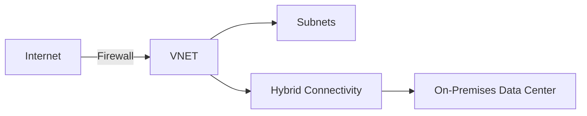

---

# Slide 4: VNET Architecture Components

### 🏠 Story Format

"Building our community requires: Land (Address Space), plots (Subnets), security gates (NSGs), street signs (Route Tables), and utility connections (Service Endpoints)."

### 🏗️ Architectural Discussion

"These components work together to create a functional, secure network. Address space defines your total available 'land,' subnets divide it logically, NSGs control traffic flow."

### ⚙️ Technical Implementation

```json
{
  "vnet": "10.0.0.0/16",
  "subnets": ["web", "app", "db"],
  "nsgs": ["allow-http", "block-internet"]
}
```

### ✅ Best Practice

"Plan your IP address space carefully - it's hard to change later. Leave room for growth."

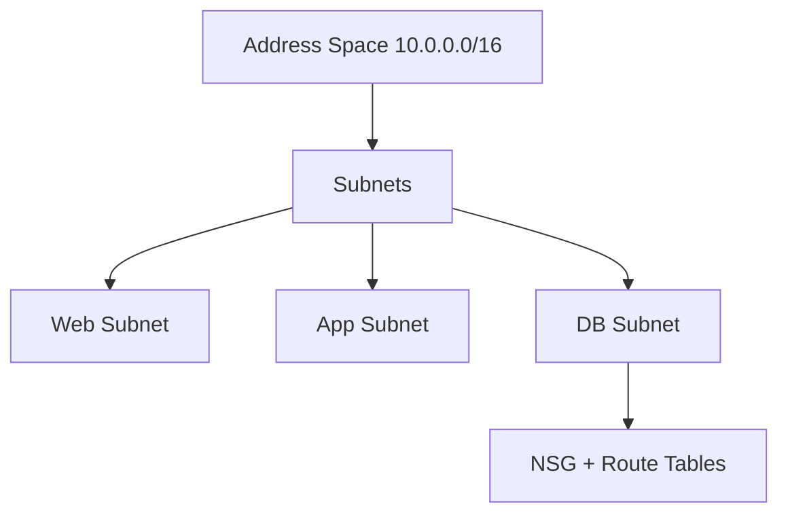

---

# Slide 5: VNET Structure Example

### 🏠 Story Format

"In our community, we have different zones: the front area for shops (Web Subnet), middle for offices (App Subnet), secure back area for vaults (DB Subnet), and management offices (Mgmt Subnet)."

### 🏗️ Architectural Discussion

"This is a classic 3-tier architecture with management. Each tier has different security requirements and communicates in a specific flow."

### ⚙️ Technical Implementation

```bash
az network vnet subnet create --name web --address-prefix 10.0.1.0/24
az network vnet subnet create --name app --address-prefix 10.0.2.0/24
az network vnet subnet create --name db --address-prefix 10.0.3.0/24
```

### ✅ Best Practice

"Use at least /24 subnets (256 IPs) for production workloads. Create dedicated management subnets for admin tools."

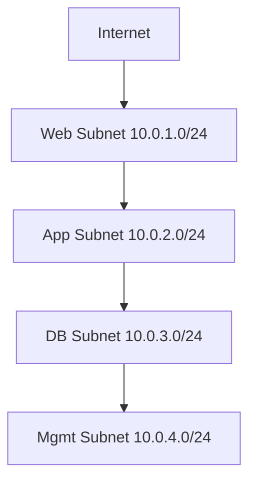

---

# Slide 6: VNET Vertical Alignment

### 🏠 Story Format

"Imagine a secure office building: Lobby (Public Tier) → Reception (Web Tier) → Manager Offices (App Tier) → Vault (Data Tier). Visitors can't jump from lobby to vault directly."

### 🏗️ Architectural Discussion

"This layered approach ensures security through segmentation. Each layer only talks to adjacent layers, preventing direct internet-to-database connections."

### ⚙️ Technical Implementation

```
Internet → [Azure Front Door] → [Web Subnet] → [App Subnet] → [DB Subnet]
```

**🔗 Azure Services Integration:**
"Use Azure Front Door or Application Gateway as your secure entry point with Web Application Firewall (WAF) protection."

**✅ Best Practice:**
"Never allow direct internet access to application or database tiers. Use load balancers between tiers."

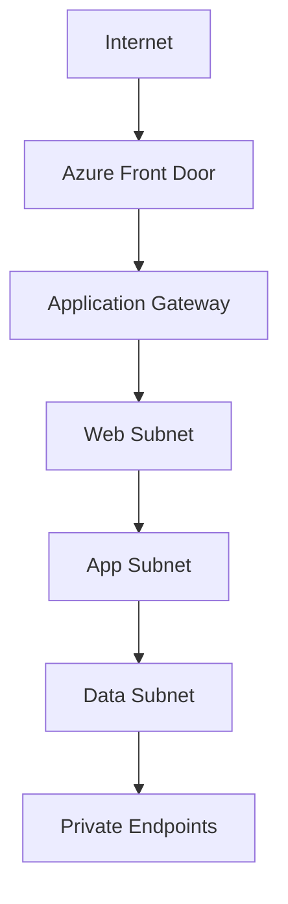

---

# Slide 7: VNET Horizontal Alignment

### 🏠 Story Format

"In each building floor (tier), different departments need to work together: IT team (Compute), file room (Data), security team (Network), and management (Monitoring)."

### 🏗️ Architectural Discussion

"Horizontal integration ensures services within the same tier can communicate efficiently while maintaining security boundaries."

### ⚙️ Technical Implementation

"Use VNET integration for App Services, Private Endpoints for databases, and service endpoints for platform services."

**✅ Best Practice:** "Use Private Endpoints for all data services - they provide the highest security by eliminating public endpoints."

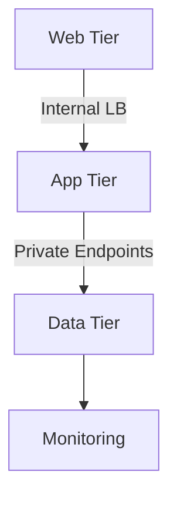

---

# Slide 8: VNET Integration Patterns

### 🏠 Story Format

"Different ways to connect to our community: Living inside (Direct), having a secret tunnel (VNET Integration), or getting a private mailbox (Private Endpoints)."

### 🏗️ Architectural Discussion

"Each pattern serves different use cases. Direct integration for IaaS, VNET integration for PaaS, Private Endpoints for maximum security."

### ⚙️ Technical Implementation

* **Direct:** VMs, AKS in subnets
* **VNET Integration:** App Service, Functions
* **Private Endpoints:** SQL, Storage, Key Vault

**✅ Best Practice:**
"Migrate from Service Endpoints to Private Endpoints for better security. Private Endpoints provide true private IP addresses."

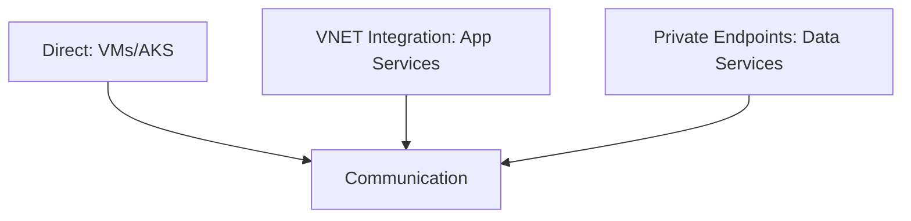

---

# Slide 9: VNET Types

### 🏠 Story Format

"Different community designs: Single house (one VNET), Town square with streets (Hub-Spoke), Sister cities (Peered VNETs), or Apartment building (Multi-tenant)."

### 🏗️ Architectural Discussion

"Hub-Spoke is the enterprise standard. Hub contains shared services (firewall, VPN), spokes contain workloads. This provides isolation and cost efficiency."

### ⚙️ Technical Implementation

```bash
az network vnet peering create --name hub-to-spoke1 \
  --remote-vnet spoke1-vnet --vnet-name hub-vnet
```

**✅ Best Practice:**
"Use Hub-Spoke for environments with multiple teams or applications. Centralize security services in the hub."

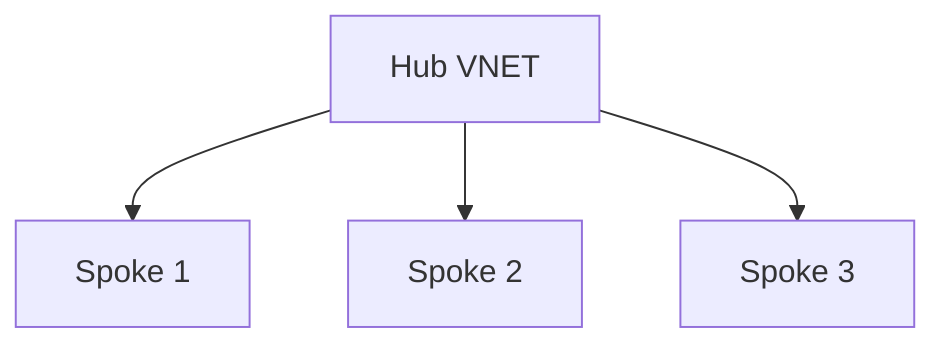

---

# Slide 10: NSG Integration

### 🏠 Story Format

"Security guards with specific instructions: 'Allow delivery trucks to shops, allow employees between offices, but block everyone from the vault area.'"

### 🏗️ Architectural Discussion

"NSGs provide distributed firewall capability. Apply at subnet level for broad policies, at NIC level for granular control."

### ⚙️ Technical Implementation

```json
{
  "NSG Rules": [
    "Allow HTTP (80) from Internet to Web Subnet",
    "Allow HTTP (8080) from Web to App Subnet",
    "Allow SQL (1433) from App to DB Subnet",
    "Deny All from Internet to DB Subnet"
  ]
}
```

**✅ Best Practice:**
"Apply NSGs at subnet level for consistency. Use service tags and ASGs for manageability."

```mermaid
graph TD
    I[Internet] -->|80| W[Web Subnet]
    W -->|8080| A[App Subnet]
    A -->|1433| D[DB Subnet]
    I -.x-|Blocked| D
```

---

# Slide 11: On-Premises Connectivity

### 🏠 Story Format

"Building roads to your main office: A toll highway (VPN) or a private direct railway (ExpressRoute). Plus a secure guard house (Bastion) for remote management."

### 🏗️ Architectural Discussion

"VPN uses encrypted internet tunnels, ExpressRoute provides private dedicated circuits. Bastion provides secure jumpbox functionality without public IPs."

### ⚙️ Technical Implementation

* **VPN Gateway:** Site-to-Site VPN
* **ExpressRoute:** Dedicated circuit
* **Bastion:** Browser-based secure RDP

**✅ Best Practice:**
"Use ExpressRoute for production workloads requiring SLA. Always use Bastion for VM management instead of public IPs."

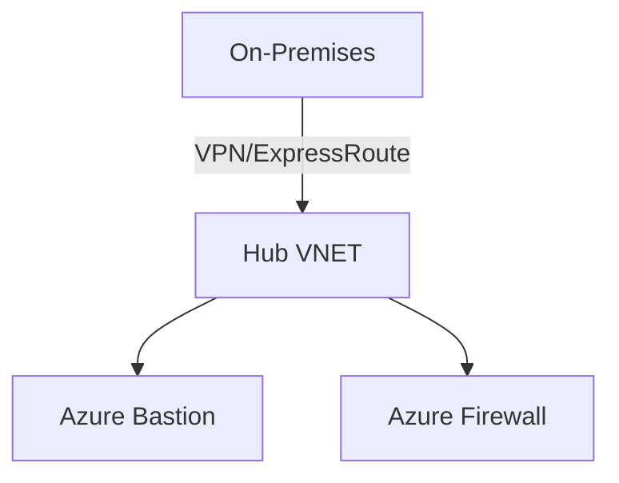

---

# Slide 12: Hybrid Architecture

### 🏠 Story Format

"Your main office connected to a central distribution center (Hub), which then connects to multiple warehouses (Spokes) for different products."

### 🏗️ Architectural Discussion

"This pattern centralizes security and connectivity while isolating workloads. All traffic between on-premises and cloud flows through the hub."

### ⚙️ Technical Implementation

```
On-Prem → VPN/ExpressRoute → [Hub VNET] → Peering → [Spoke VNETs]
```

**✅ Best Practice:**
"Implement Azure Firewall in the hub for centralized policy enforcement."

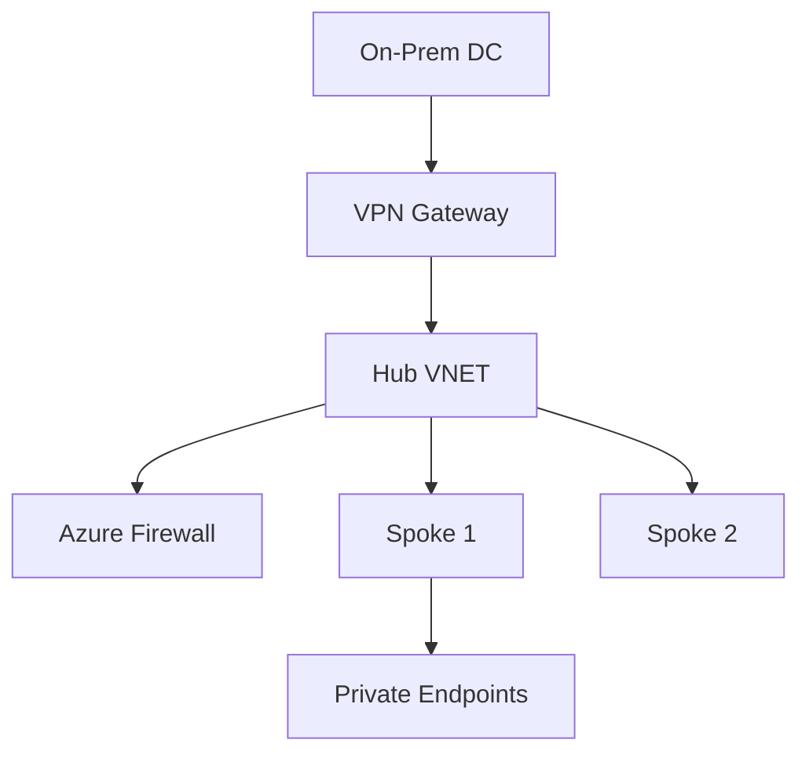

---

# Slide 13: E-Commerce Example

### 🏠 Story Format

"Building Amazon: Customers enter through main doors (Front Door), browse products (Web Tier), add to cart (App Tier), process payments and update inventory (Data Tier)."

### 🏗️ Architectural Discussion

"Real-world implementation of all concepts: layered architecture, private endpoints, subnet segregation, and secure management."

### ⚙️ Technical Implementation

```yaml
Web Tier: AKS pods + Public LB
App Tier: Functions + Internal LB
Data Tier: SQL + Cosmos DB + Private Endpoints
Management: Bastion + Monitor
```

**✅ Best Practice:**
"Use Private Endpoints for all data services. Implement Azure Bastion for secure management."

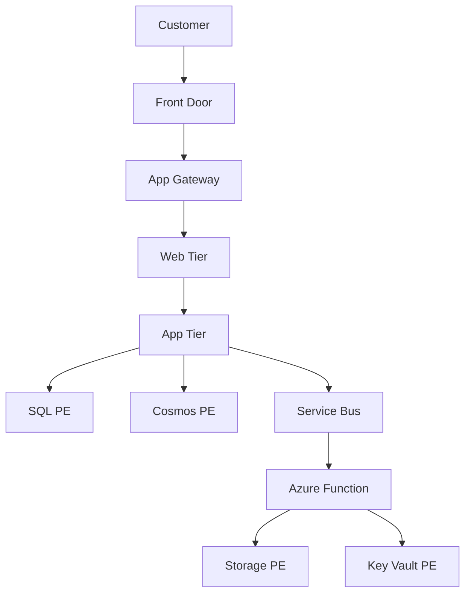

---

# Slide 14: Public vs Private Resources

### 🏠 Story Format

"Storefront vs Back Office: The store is public-facing but secure, while the accounting office is completely private."

### 🏗️ Architectural Discussion

"Public resources have public IPs and are designed for external access. Private resources only have internal IPs and are accessed through routing."

### ⚙️ Technical Implementation

* **Public:** Front Door, Application Gateway
* **Private:** Internal LB, Private Endpoints

**✅ Best Practice:**
"Minimize public endpoints. Use one secured entry point."

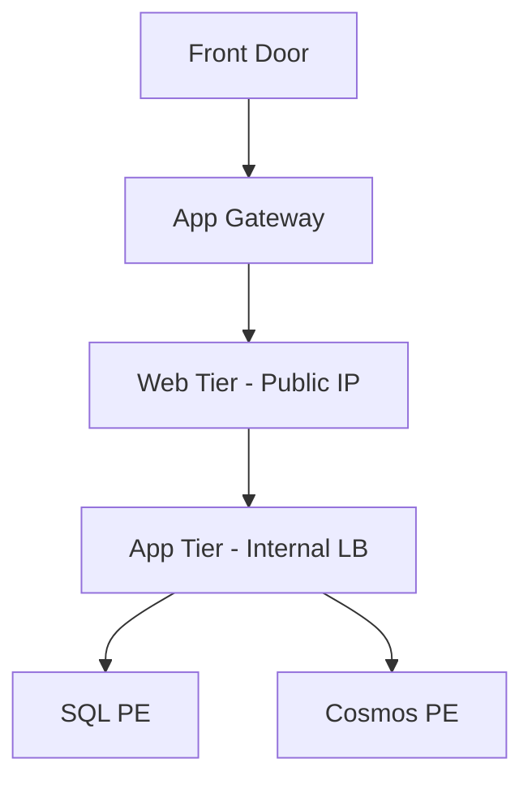

---

# Slide 15: Multi-Cloud & Multi-Subscription

### 🏠 Story Format

"Connecting different company departments (subscriptions) and even different clouds into one network."

### 🏗️ Architectural Discussion

"VNET peering across subscriptions; VPN or ExpressRoute for multi-cloud."

### ⚙️ Technical Implementation

* **Cross-subscription:** VNET peering
* **Multi-cloud:** Azure VPN to AWS/GCP

**✅ Best Practice:**
"Use Azure Lighthouse for cross-subscription management."

```mermaid
graph TD
    HUB[Hub VNET (Azure)] --> SPOKEA[Spoke A]
    HUB --> SPOKEB[Spoke B]
    HUB --> VPN[VPN Gateway]
    VPN --> AWS[AWS VPC]
    VPN --> GCP[GCP VPC]
    HUB --> TM[Azure Traffic Manager]
```

---

# Slide 16: Implementation Guide

### 🏠 Story Format

"Our step-by-step recipe: 1) Draw map 2) Prepare land 3) Install security 4) Build houses 5) Test everything."

### 🏗️ Architectural Discussion

"Proper planning prevents poor performance."

### ⚙️ Technical Implementation

```bash
# 1. Plan: Diagram + IP scheme
# 2. Create: az network vnet create
# 3. Secure: az network nsg create
# 4. Deploy: VMs, Apps, Databases
# 5. Validate: Connectivity tests + Azure Monitor
```

**✅ Best Practice:**
"Document IPs. Use IaC (Terraform/Bicep)."

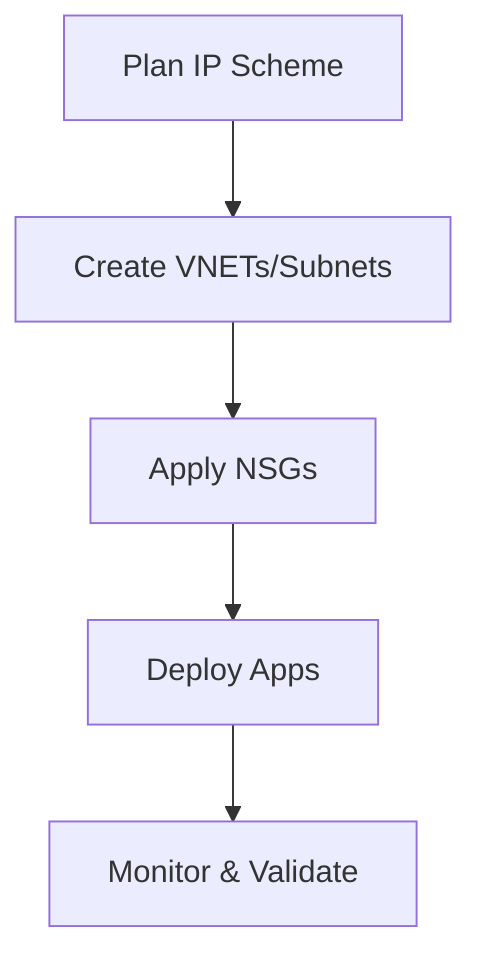

---

# Slide 17: Key Takeaways

### 🏠 Story Format

"Remember: Build on solid land, create secure zones, plan for expansion."

### 🏗️ Architectural Discussion

"Foundation first, security by design, hybrid readiness."

### ⚙️ Technical Implementation

"VNET → Subnets → NSGs → Private Endpoints → Hub-Spoke → Monitoring"

### ✅ Best Practice

"Start simple but design for scale."

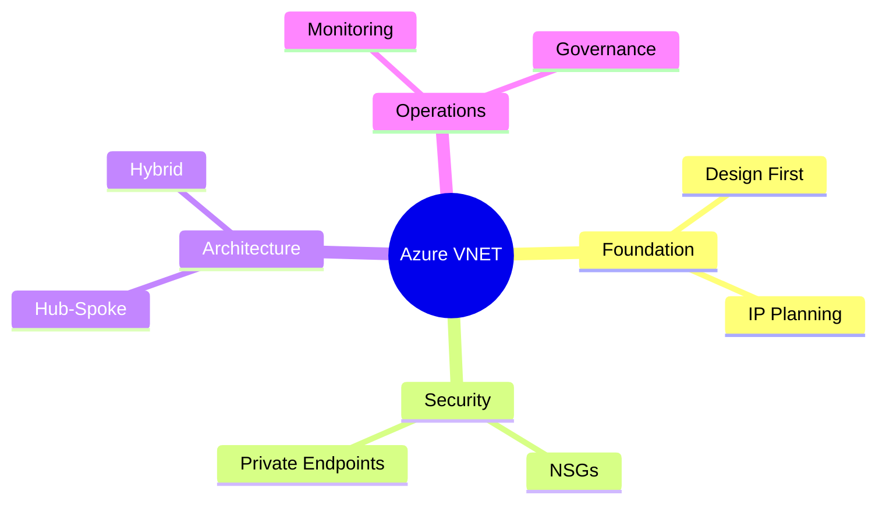

---

# Slide 18: Thank You!

### 🏠 Story Format

"You're now ready to build secure, well-organized neighborhoods in the cloud! Remember: good planning makes cloud networking smooth and secure."

### 🔗 Next Steps

"Explore Azure Firewall, Network Watcher, and implement these concepts in a lab environment."

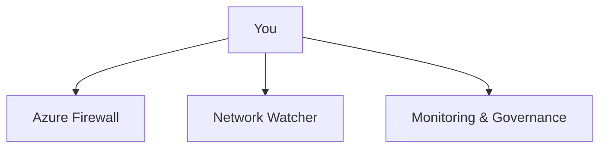

```

---

✅ **Done!**  
This file is **GitHub-ready** — just save it as `Azure-VNET-Architecture.md` in your repo.  
All Mermaid diagrams will render automatically on GitHub and Obsidian.
```
